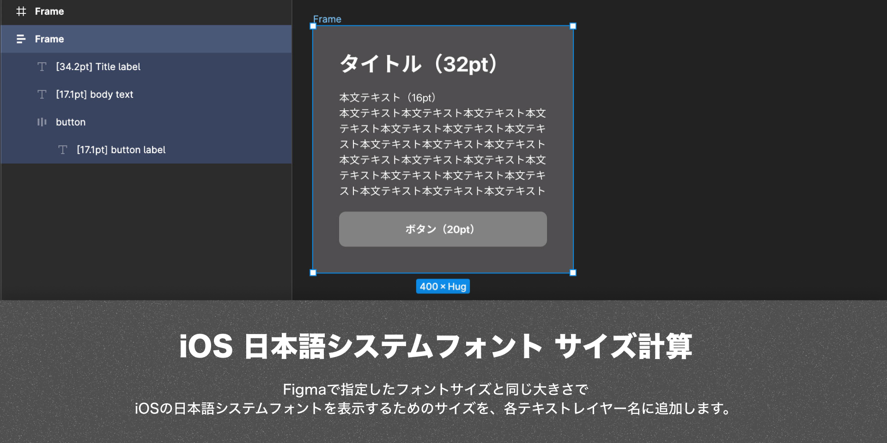

# Figma Plugin - iOS ja system font size

iOSでシステムフォントを指定して日本語のテキストラベルを表示した場合、実際に指定したフォントサイズよりも小さく表示されます。
Figmaではこのようなシステムフォントを再現することができないため、Figmaで作成したテキストラベルと同じ大きさの日本語テキストラベルを表示するためのサイズを計算し、レイヤー名に追加します。
エンジニアはテキストのレイヤー名に表示されるフォントサイズを実装時に指定することで、同じ文字サイズを表示することができます。

# Usage - 使い方
- 適用したいテキストオブジェクトを選択状態にします（グループを選択したり、複数選択した場合は、選択したすべてのテキストオブジェクトに適用されます）
- iOS ja system font sizeプラグインのInteger/Floatをメニューから実行します
    - Integerは小数点以下を四捨五入し、整数で表示します
    - Floatは小数点第二位以下を四捨五入し、小数も含めて表示します（より正確にしたい場合にお使いください）
- レイヤー名の先頭に`*`が入っている場合は、Figmaで指定した通りのフォントサイズを追加します
    - アルファベットや数字のみで表示される箇所など、実際の指定通りのサイズのままにしておきたい箇所にお使いください
